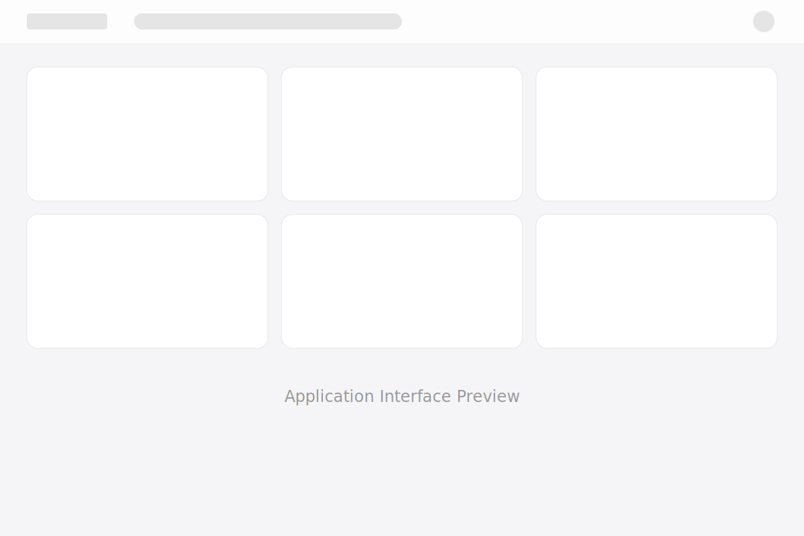

<div align="center">


# WEAPI

**The Geek's Holy Land - Ultimate API Aggregation Platform**

[](LICENSE)
[](https://weapi.vercel.app)
[](https://github.com/jeneekuqtfbruckk-cyber/weapi/releases)
[](https://nextjs.org)

</div>

---

## 📸 应用界面

<div align="center">



</div>

---

## ✨ 功能特性

- 🔮 **原子化定价**：基于 "Atoms" 的微支付模型，精确计费，灵活透明
- 🔐 **统御级鉴权**：集成 Supabase Auth，支持 OAuth (Google/GitHub) 及 API Key 管理
- 📊 **实时仪表盘**：全方位监控 API 调用用量、成本及性能指标
- 🎨 **极致 UI/UX**：模仿 Apple 设计美学的现代化界面，Glassmorphism 视觉风格
- ⚡ **全球加速**：基于 Vercel Edge Network 的超低延迟响应
- 🔄 **异构集成**：统一封装 REST, GraphQL, GRPC 等多种协议接口
- 📦 **开箱即用**：提供多语言 SDK (TypeScript, Python, Go) 及详尽文档

---

## 📥 部署接入

### 系统要求
- **运行环境**：Node.js 18+ / Bun 1.0+
- **数据库**：PostgreSQL (Supabase 托管推荐)
- **网络**：需要访问 Supabase 及 Vercel API

### 安装步骤
1. 克隆仓库
   ```bash
   git clone https://github.com/jeneekuqtfbruckk-cyber/weapi.git
   ```
2. 安装依赖
   ```bash
   npm install
   # 或
   bun install
   ```
3. 配置环境变量 (`.env.local`)
   ```env
   NEXT_PUBLIC_SUPABASE_URL=your_supabase_url
   NEXT_PUBLIC_SUPABASE_ANON_KEY=your_supabase_anon_key
   ```
4. 启动开发服务器
   ```bash
   npm run dev
   ```

💡 **提示**：推荐使用 [Vercel](https://vercel.com) 进行一键生产环境部署。

### ⚠️ 安全提示
本平台涉及 API Key 及支付凭证管理。

**安全最佳实践**：
- ✅ **密钥轮换**：定期重置您的 API Secret
- ⏳ **最小权限**：仅授予应用必要的 Scope 权限
- ⚠️ **私有部署**：如处理敏感数据，建议在私有 VPC 环境部署

---

## 🚀 快速开始

首次访问 WEAPI？

1. **注册账户**：使用 GitHub 或 Google 账号一键登录。
2. **获取 Atoms**：在 [Pricing](/pricing) 页面充值原子余额。
3. **浏览市场**：在 [Marketplace](/collections) 发现您需要的 API。
4. **生成 Key**：在控制台创建 API Key 并开始调用。

---

## 🛠️ 技术架构

本项目采用当下最先进的全栈 Web 技术构建：

<div align="center">

| 核心层 | 技术选型 | 说明 |
| :--- | :--- | :--- |
| **Frontend** | **Next.js 14** | App Router, Server Components |
| **Language** | **TypeScript** | 强类型安全保证 |
| **Styling** | **Tailwind CSS** | Utility-first CSS 框架 |
| **Backend** | **Supabase** | Backend-as-a-Service (PostgreSQL) |
| **Auth** | **Supabase Auth** | JWT, OAuth 集成 |
| **State** | **Zustand** | 轻量级状态管理 |
| **Icons** | **Lucide React** | 现代化图标库 |

</div>

---

## 💻 开发指南

### 本地开发

```bash
# 启动开发服务
npm run dev

# 构建生产版本
npm run build

# 运行 Lint 检查
npm run lint
```

### 目录结构

```
weapi/
├── src/
│   ├── app/          # Next.js App Router 页面
│   ├── components/   # React 组件 (Atomic Design)
│   ├── lib/          # 工具函数库
│   ├── store/        # Zustand 状态管理
│   └── types/        # TypeScript 类型定义
├── public/           # 静态资源
├── doc/              # 项目文档
└── ...配置文件
```

---

## 🤝 贡献指南

我们欢迎社区贡献！

### 贡献流程
1. Fork 本仓库
2. 创建特性分支 (`git checkout -b feature/AmazingFeature`)
3. 提交更改 (`git commit -m 'Add some AmazingFeature'`)
4. 推送到分支 (`git push origin feature/AmazingFeature`)
5. 提交 Pull Request

### 代码规范
请遵循项目配置的 ESLint 和 Prettier 规则。

---

## 📄 许可与支持

本项目基于 [MIT 协议](LICENSE) 开源。

- **官方文档**：[weapi.dev/docs](https://weapi.dev/docs)
- **问题反馈**：[GitHub Issues](https://github.com/jeneekuqtfbruckk-cyber/weapi/issues)
- **联系我们**：support@weapi.dev

<div align="center">
  <sub>Built with ❤️ by the WEAPI Team. © 2026</sub>
</div>
